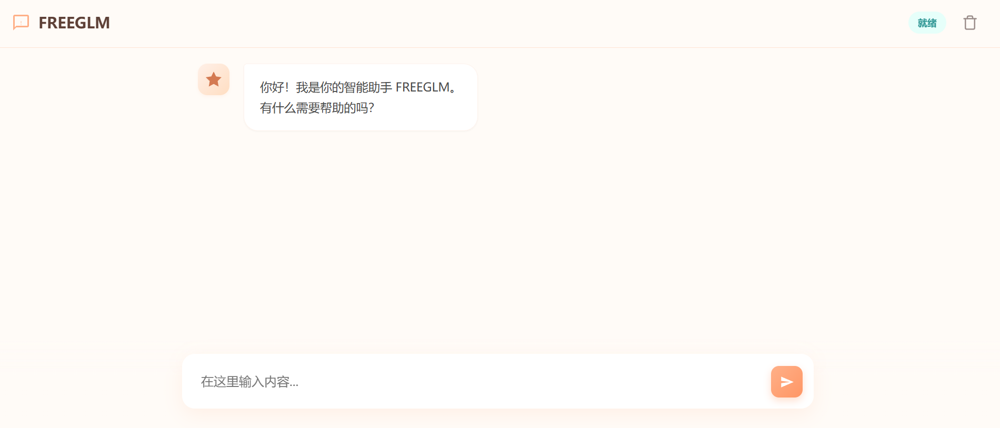

# FREEGLM


[中文文档](#中文文档) | [English Documentation](#english-documentation)

<div align="center">

  **如果这个项目对你有帮助，请点个 Star 支持一下！ ⭐**
 
  **If this project helps you, please give a Star to support me! ⭐**
  
  [](https://github.com/wangshengithub/FREEGLM/stargazers)
  [](https://github.com/wangshengithub/FREEGLM/network/members)

</div>

---

## 中文文档

FREEGLM 是一个基于 GLM-4 的免费 AI 对话工具，无需任何配置即可在本地运行。

### 🖼️ 项目截图

<div align="center">
  
</div>

### ✨ 特性

* 🚀 **开箱即用**：内置代理，解决了官方 API 的跨域限制，无需安装浏览器插件。
* 🤖 **流式响应**：实时显示，体验流畅。
* 🔒 **本地安全**：数据通过本地 Node.js 服务转发，不经过第三方云服务。
* 📦 **轻量级**：仅依赖少量 Node.js 库。
* ⭐ **开源免费**：完全开源代码，欢迎 Fork 和 Star。

### 📦 安装与运行

#### 前置要求

请确保你的电脑上已经安装了 **Node.js** (建议版本 18 或更高)。  
[下载 Node.js](https://nodejs.org/)

#### 快速开始

1. **克隆项目**
   
   ```bash
   git clone https://github.com/wangshengithub/FREEGLM
   cd FREEGLM
   ```

2. **安装依赖**
   
   ```bash
   npm install
   ```

3. **启动服务**
   
   ```bash
   npm start
   ```

4. **访问网页**
   启动成功后，打开浏览器访问：
   **[http://localhost:33333](http://localhost:33333)**

### 🛠️ 技术实现

本项目使用 **Node.js + Express** 搭建了一个本地代理服务器：

* 自动修改请求头 `Origin` 和 `Referer` 以通过 API 验证。
* 自动处理 `Cookie` 维持会话状态。
* 前端页面通过 SSE 接收流式数据。

### 📝 使用说明

1. 启动服务后，直接在网页输入框发送消息即可。
2. 如果遇到网络错误，请确保你的网络可以访问 `v8.qqslyx.com`。

## ⚠️ 免责声明

1. **非官方产品**：本项目 (`FREEGLM4`) 是一个非官方的第三方客户端工具，与 GLM 官方或 API 提供商 (`v8.qqslyx.com`) 没有任何从属、合作或关联关系。
2. **数据隐私风险**：用户通过本软件发送的消息内容会被转发至第三方 API 服务器。**请勿在使用本工具时输入任何个人隐私、敏感信息、密码或受法律保护的机密数据。** 作者不对用户数据的泄露或丢失负责。
3. **内容责任**：AI 生成的内容可能存在不准确、有偏见或不恰当的信息。用户应对使用本软件生成的所有内容自行判断并承担全部风险，作者不对生成内容的准确性和可用性承担任何责任。
4. **服务可用性**：本工具依赖上游 API 的服务稳定性。若上游 API 停止服务、更改接口或限流，本工具将无法正常使用，作者不承诺提供长期维护或修复。
5. **法律合规**：请确保您对本软件的使用符合当地法律法规的服务条款。因使用本软件而产生的一切法律纠纷，由使用者自行承担。

### 🤝 贡献

欢迎提交 Issue 或 Pull Request！

### 📄 License

MIT License

---

## English Documentation

FREEGLM is a free AI conversation tool based on GLM-4 that requires no configuration to run locally.

### 🖼️ Screenshot

<div align="center">
  
</div>

### ✨ Features

* 🚀 **Ready to Use**: Built-in proxy solves CORS issues with the official API. No browser plugins required.
* 🤖 **Streaming Response**: Real-time display for a smooth experience.
* 🔒 **Local & Secure**: Data is forwarded via a local Node.js server; no pass-through via third-party clouds.
* 📦 **Lightweight**: Minimal dependencies.
* ⭐ **Open Source & Free**: Fully open-source. Feel free to Fork and Star!

### 📦 Installation & Usage

#### Prerequisites

Ensure you have **Node.js** installed (Version 18 or higher recommended).
[Download Node.js](https://nodejs.org/)

#### Quick Start

1. **Clone the Project**
   
   ```bash
   git clone https://github.com/wangshengithub/FREEGLM
   cd FREEGLM
   ```

2. **Install Dependencies**
   
   ```bash
   npm install
   ```

3. **Start the Server**
   
   ```bash
   npm start
   ```

4. **Open in Browser**
   Once started, open your browser and navigate to:
   **[http://localhost:33333](http://localhost:33333)**

### 🛠️ Technical Implementation

This project uses **Node.js + Express** to build a local proxy server:

* Automatically modifies `Origin` and `Referer` headers to pass API authentication.
* Automatically handles `Cookie` management to maintain session state.
* The frontend receives streaming data via SSE.

### 📝 Usage Guide

1. Start the server, then simply type your message in the web interface.
2. If you encounter network errors, please ensure your network can access `v8.qqslyx.com`.

## ⚠️ Disclaimer

1. **Non-Official Product**: This project (`FREEGLM4`) is an unofficial third-party client tool and has no affiliation, partnership, or association with GLM officials or the API provider (`v8.qqslyx.com`).
2. **Data Privacy Risks**: Messages sent via this software are forwarded to third-party API servers. **Please do not input any personal privacy, sensitive information, passwords, or legally protected confidential data when using this tool.** The author assumes no responsibility for user data leakage or loss.
3. **Content Responsibility**: AI-generated content may contain inaccuracies, biases, or inappropriate information. Users should judge independently and assume all risks for content generated using this software. The author bears no responsibility for the accuracy or usability of the generated content.
4. **Service Availability**: This tool depends on the stability of the upstream API. If the upstream API stops service, changes interfaces, or imposes rate limits, this tool may not function properly. The author does not commit to providing long-term maintenance or fixes.
5. **Legal Compliance**: Please ensure your use of this software complies with local laws, regulations, and the API provider's terms of service. Any legal disputes arising from the use of this software are the sole responsibility of the user.

### 🤝 Contributing

Issues and Pull Requests are welcome!

### 📄 License


MIT License
